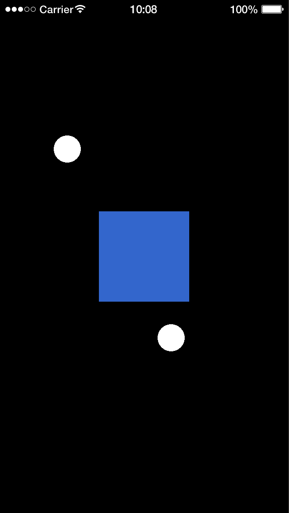

# dmc-touchmanager

True multi-touch for Solar2D (formerly Corona SDK): any number of touches can hold focus on the same display object, for pinch, rotate and other gestures.

In Solar2D, `stage:setFocus( object, event.id )` gives an object focus for one touch at a time: focusing a second touch on the same object replaces the first. dmc-touchmanager keeps its own focus list instead, so an object can hold every touch that began on it and keep getting their events wherever they move:

```lua
local TouchMgr = require 'dmc_corona.dmc_touchmanager'

function square:touch( event )
	if event.phase == 'began' then
		TouchMgr.setFocus( self, event.id )    -- instead of stage:setFocus()
		return true
	end
	if not event.isFocused then return false end
	-- 'moved', 'ended', 'cancelled' for every touch the square holds
	...
end

TouchMgr.register( square )    -- instead of square:addEventListener( 'touch' )
```

## Features

- Several touches focused on one object at the same time, each released on its own
- A focused touch keeps going to its object when it moves off it, even over other registered objects
- `event.isFocused` tells a handler whether the touch belongs to its object
- Function and table listeners, as with `addEventListener()`, and several per object
- Turns on Solar2D's multitouch when it loads
- The touch layer under [dmc-gestures](https://github.com/dmccuskey/dmc-gestures) and the scroll views of [DMC-Corona-UI](https://github.com/dmccuskey/DMC-Corona-UI)
- Pure Lua, no plugins needed; MIT licensed

## Quick Start

The following code will get you up and running in about 10 minutes in the Solar2D Simulator on macOS or Windows. It makes a square that puts a dot under each touch it holds, and keeps the dots following their touches off the square.

Prerequisites: the [Solar2D](https://solar2d.com/) Simulator and a copy of this repository (`git clone https://github.com/dmccuskey/dmc-touchmanager.git`, or download the ZIP from GitHub). The Simulator has one touch, the mouse; for more than one, build to a device.

### 1. Copy the Library into Your Project

Copy these from this repository into the root of your project folder:

```text
dmc_corona_boot.lua     loader for the DMC libraries
dmc_corona.cfg          configuration
dmc_corona/             dmc-touchmanager
```

**Going further:** keep the libraries in a subfolder, or combine several DMC libraries ([dmc-corona-boot Configuration](https://github.com/dmccuskey/dmc-corona-boot/blob/master/docs/configuration.md)).

### 2. A Square That Holds Touches

Create `main.lua` in the project folder:

```lua
local TouchMgr = require 'dmc_corona.dmc_touchmanager'

local square = display.newRect( display.contentCenterX, display.contentCenterY, 200, 200 )
square:setFillColor( 0.2, 0.4, 0.8 )
square.dots = {}  -- a dot under each touch the square holds, by touch id

local function count( dots )
	local n = 0
	for _ in pairs( dots ) do n = n + 1 end
	return n
end

function square:touch( event )
	local id = event.id

	if event.phase == 'began' then
		TouchMgr.setFocus( self, id )  -- this touch now belongs to the square
		self.dots[ id ] = display.newCircle( event.x, event.y, 30 )
		print( 'began', 'touches held:', count( self.dots ) )
		return true
	end

	if not event.isFocused then return false end  -- not one of our touches

	local dot = self.dots[ id ]
	if event.phase == 'moved' then
		dot.x, dot.y = event.x, event.y
	else  -- 'ended' or 'cancelled'
		TouchMgr.unsetFocus( self, id )
		dot:removeSelf()
		self.dots[ id ] = nil
		print( event.phase, 'touches held:', count( self.dots ) )
	end
	return true
end

TouchMgr.register( square )
```

Open the project in the Simulator and drag from the square out into the black. The dot follows the mouse off the square, and the console shows:

```text
WARNING: Simulator does not support multitouch events
began	touches held:	1
ended	touches held:	0
```

The warning comes from Solar2D when dmc-touchmanager turns multitouch on; a device doesn't print it.

On a device, put two fingers on the square and move them apart: each has its own dot, and the console counts `touches held: 2`, as in this screenshot:



Each handler call is for one touch: `event.id` says which. Call `TouchMgr.setFocus()` with a dot (`.`), not a colon.

If the console shows `module 'dmc_corona.dmc_touchmanager' not found` instead, `dmc_corona/` is missing from the root of the project folder.

**Going further:** function listeners, several handlers per object, how focused touches are routed and what to watch out for are in the [API reference](docs/api.md); the [example](examples/) has two objects, one with each listener style.

To update, copy `dmc_corona_boot.lua` and `dmc_corona/` again from the newer version. Keep your own `dmc_corona.cfg` if you have changed it.

## Documentation

- [API reference](docs/api.md): `register()`, `setFocus()` and the rest, the touch event, how touches are routed, known issues
- [Examples](examples/): two objects, one with a table listener and one with a function listener

Everything else is listed on the [documentation home](docs/README.md).

## License

dmc-touchmanager is released under the [MIT License](LICENSE).
