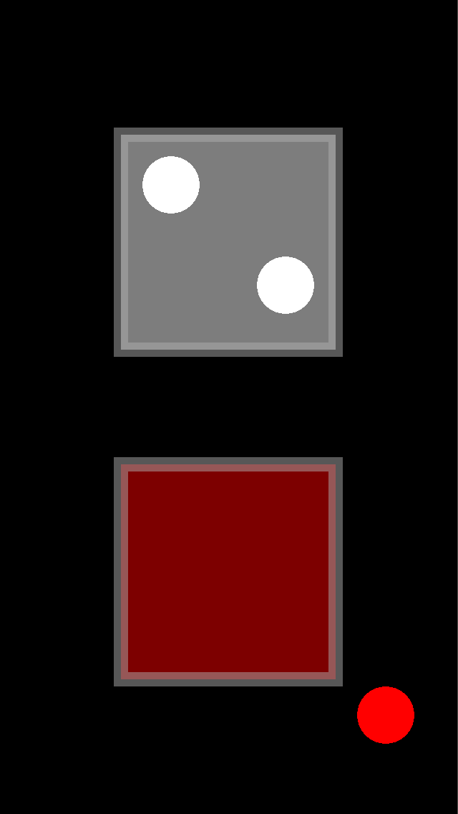

# Examples

Each folder is a complete Solar2D project with its own copy of the library: open its `main.lua` in the Solar2D Simulator.

| | |
|---|---|
|  | **dmc-touchmanager-basic**: two squares. Touching one puts a dot under the touch, highlights the square's border, and keeps the dot following the touch, on or off the square, until it ends. The top square uses a table listener (`square:touch()`), the bottom one a function listener. The screenshot shows two touches on the top square and one on the bottom square that moved off it; in the Simulator there is one touch, the mouse. |
